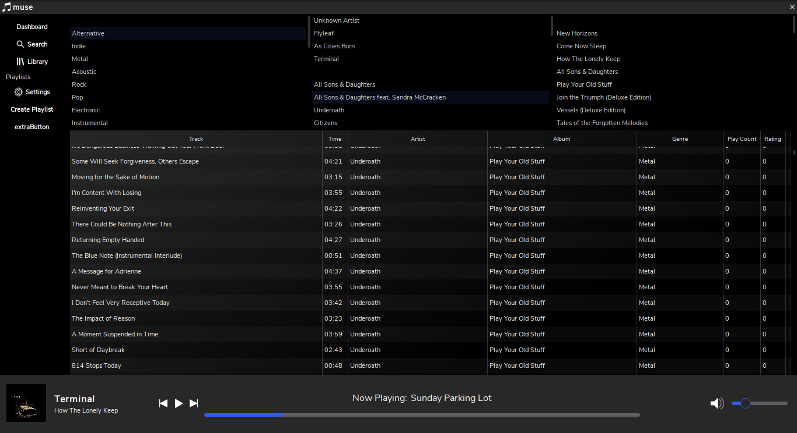
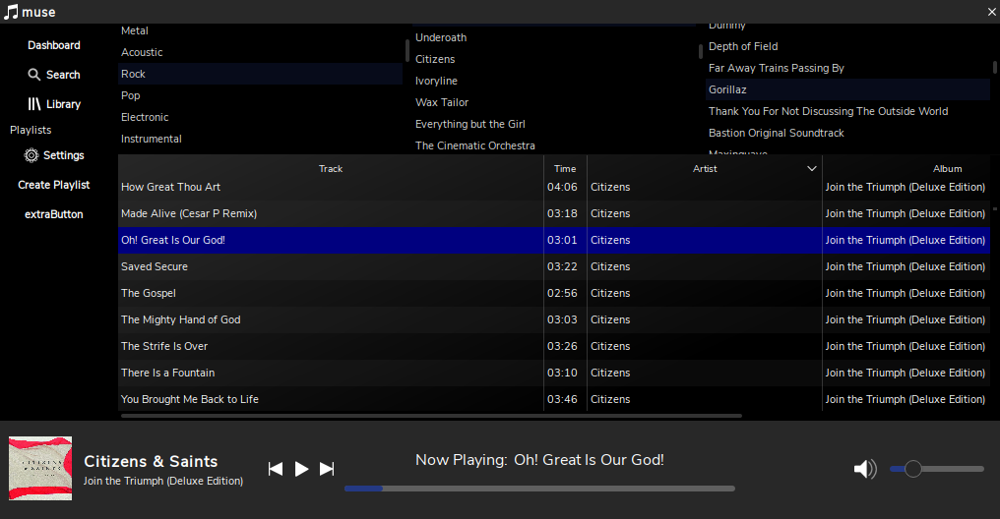
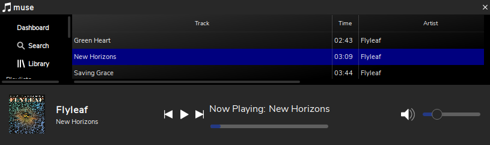

# MusicPlayer

Qt based music player

### Depends on
>=taglib-1.11.1
>=qtcore-5.12.3
>=qtmultimedia-5.12.3
>=sqlite-3.29.0

## Features
- Browse Songs, Albums, Artists

## Screenshots

## Changelog

## Credits

# Donate

## License

>(c) 2019 Jacob Petriella

>This is free software: you can redistribute it and/or modify it under the terms of the GNU General Public License as published by the Free Software Foundation, either version 3 of the License, or (at your option) any later version. 

>This software is distributed in the hope that it will be useful, but WITHOUT ANY WARRANTY; without even the implied warranty of MERCHANTABILITY or FITNESS FOR A PARTICULAR PURPOSE. See the GNU General Public License for more details. 

>You should have received a copy of the GNU General Public License along with this app. If not, see <https://www.gnu.org/licenses/>.

